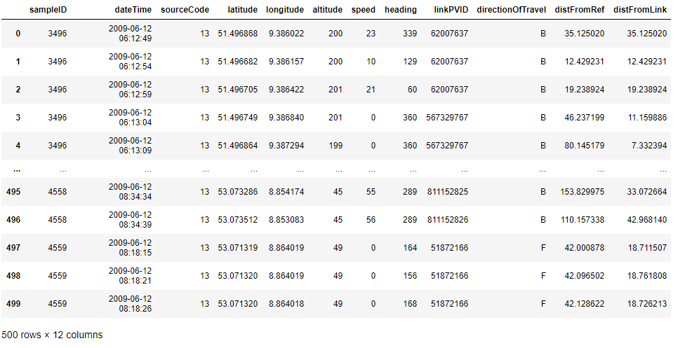
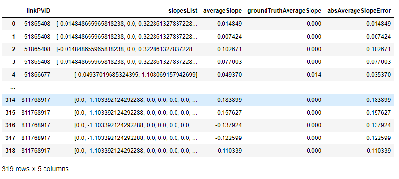

# Probe Data Analysis for Road Slope
### Authors: Christopher Tsai, Anuj Karnik
Second assignment for EE 495: Geospatial Vision and Visualization, Northwestern University, Spring 2020.

## Tasks
Given probe data that was collected for several months, do the following in a map:
- Map match probe points to road links.
- Derive road slope for each road link.
- Evaluate the derived road slope with the surveyed road slope in the link data file.

## Dependencies
- Pandas
- gmaps
- Haversine

## Link Matching 
### Methodology
1. Input a probe point of the form [`latitude`, `longitude`].
2. Create Pandas DataFrame that contains [`linkPVID`, `shapeInfo`, `shapeList`] columns from `Partition6467LinkData.csv`.
3. Add a column `distFromLink` which contains the distance from the probe point to the nearest link. This is done by applying a Lambda function to the entries of the `shapeInfo` column of the DataFrame. This Lambda function takes the minimum Great Circle distance (using haversine Python library function) of the probe point to all [`latitude`, `longitude`] pairs from `shapeInfo` column of DataFrame.
4. Identify the link by acquiring the corresponding link’s `linkPVID`.
5. The output file `Partition6467MatchedPoints.csv` also requires  `distFromLink` — the distance of each probe point to reference node of link. To do this:
   1. Acquire corresponding index of the `linkPVID` in DataFrame.
   2. Use this index to get first entry of `shapeInfo` of each link, which is the ref node.
   3. Calculate Great Circle distance from probe point to ref node.

### Results (sample size = 500)

### Visualizing Probe Points and Links in gmaps:

## Slope Calculation
### Methodology
1. Use Pandas function `groupby()` to group link matching DataFrame rows to each `linkPVID`.
2. Acquire probe points that matched to each `linkPVID`.
3. Iterate through probe points, calculating distance between them and altitude difference between them.
4. Calculate slope for each pair in degrees using `arctan(changeInAltitude/distance)`.
5. After iterating, take average of all slopes of each link and output it.
6. Calculate error between this and the average of slopes per link of `Partition6467LinkData.csv`.

### Results (sample size = 500)

## Results Discussion
- From visualizing the probe points and links in gmaps, it is observed that points are matched to corresponding link correctly for the most part.
- Slope results turned out to be relatively similar to the theoretical slope values, but total average error of 0.24 degrees does seem high considering that the error is higher than some slope values themselves.

## Problems and Improvements
- As mentioned before, slope accuracy can be improved, possibly by using a higher sample size or more robust algorithms.
- The main reason such a small sample size was used (when compared to the total sample size) is that the code is very slow.
- Other metrics can be combined with Great Circle distance to determine link matching.
